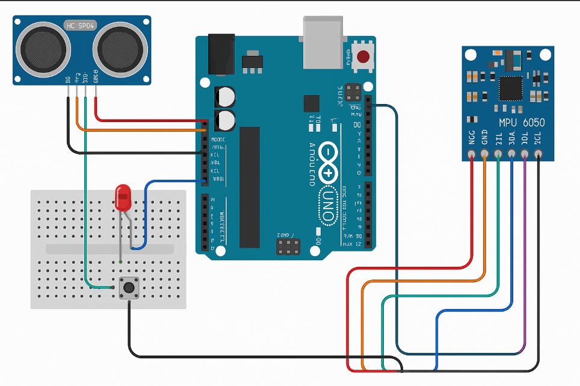

# Sensor Dashboard – Phase 1

## Overview
This project creates a real-time sensor dashboard using an Arduino Uno and Python.  
Phase 1 focuses on setting up and testing hardware sensors:
- HC-SR04 Ultrasonic Distance Sensor
- MPU-6050 Accelerometer and Gyroscope

Data is transmitted via serial communication to the computer and displayed for verification.

---

## Hardware Setup

**Components:**
- Arduino Uno
- HC-SR04 Ultrasonic Sensor
- MPU-6050 Accelerometer/Gyroscope
- Breadboard
- Jumper Wires
- Resistors (optional for LEDs later)

---

## Wiring Diagram

### HC-SR04 Ultrasonic Sensor
| Sensor Pin | Arduino Pin |
|------------|-------------|
| VCC        | 5V          |
| GND        | GND         |
| Trig       | D9          |
| Echo       | D10         |

### MPU-6050 Sensor
| Sensor Pin | Arduino Pin |
|------------|-------------|
| VCC        | 3.3V        |
| GND        | GND         |
| SDA        | A4          |
| SCL        | A5          |

---

## Arduino Test Code

The following sketches were used to verify the hardware:

| Filename | Purpose |
|----------|---------|
| `Arduino/Phase1_DistanceSensor.ino` | Test and output distance readings from the HC-SR04 sensor |
| `Arduino/Phase1_MPU6050.ino` | Test and output Z-axis acceleration readings from the MPU-6050 sensor |

---

## Sample Serial Output

