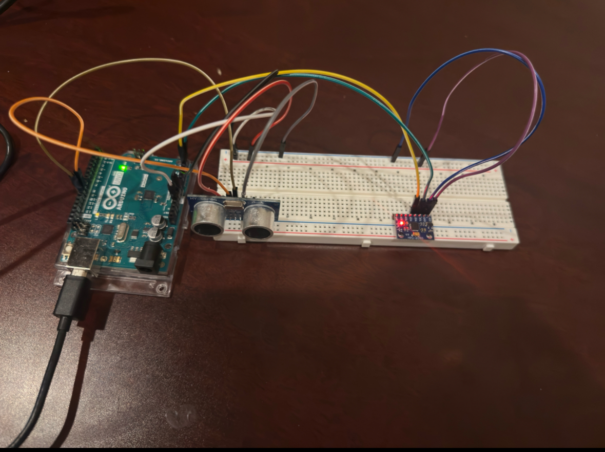

# Sensor Dashboard – Phase 1

## Overview
This project creates a real-time sensor dashboard using an Arduino Uno and Python.  
Phase 1 focuses on setting up and testing hardware sensors:
- HC-SR04 Ultrasonic Distance Sensor
- MPU-6050 Accelerometer and Gyroscope

Data is transmitted via serial communication to the computer and displayed for verification.

---

## Hardware Setup

**Components:**
- Arduino Uno
- HC-SR04 Ultrasonic Sensor
- MPU-6050 Accelerometer/Gyroscope
- Breadboard
- Jumper Wires
- Resistors (optional for LEDs later)

---

### Circuit Photo

### HC-SR04 Ultrasonic Sensor
| Sensor Pin | Arduino Pin |
|------------|-------------|
| VCC        | 5V          |
| GND        | GND         |
| Trig       | D9          |
| Echo       | D10         |

### MPU-6050 Sensor
| Sensor Pin | Arduino Pin |
|------------|-------------|
| VCC        | 3.3V        |
| GND        | GND         |
| SDA        | A4          |
| SCL        | A5          |

---

## Arduino Test Code

The following sketches were used to verify the hardware:

| Filename | Purpose |
|----------|---------|
| `Arduino/Phase1_DistanceSensor.ino` | Test and output distance readings from the HC-SR04 sensor |
| `Arduino/Phase1_MPU6050.ino` | Test and output Z-axis acceleration readings from the MPU-6050 sensor |

---

## Sample Serial Output
Distance (cm): 36.06
Accel (X Y Z): 244 -388 17160
Gyro (X Y Z):  368 -62 -80

## Phase 1 Completion

- ✅ Built physical circuit with HC-SR04 Ultrasonic Sensor and MPU6050 Accelerometer/Gyro
- ✅ Verified live data printed to Serial Monitor
- ✅ Arduino sketches uploaded and tested successfully

---

# ✅ Sensor Dashboard – Phase 2: Real-Time Python Plotting

## Overview
Phase 2 implements live data visualization using Python and Matplotlib.  
Sensor readings from the Arduino are streamed via serial and plotted in real time.

---

## Features

- 📡 **Live distance plotting** from HC-SR04
- ✅ Distance values are filtered using:
  - Range clamping (2–200 cm)
  - 5-point moving average smoothing
- 🧠 Smart logic: only print/send distance if it changes by more than 5 cm

---

## Python Files

| Filename | Purpose |
|----------|---------|
| `Python/live_plot_distance.py` | Real-time distance plot with smoothing and outlier rejection |

---

## How It Works

- Arduino sends formatted lines like:  
  `13.07,204,-460,17032,356,-97,-47`  
- Python reads the serial line, parses the distance, and appends it to a live Matplotlib graph

---

## Sample Plot
_*(Add a screenshot here later)*_

---

## Phase 2 Completion

- ✅ Developed Python script to read and plot live distance data  
- ✅ Applied filtering and change detection for clean visual output  
- ✅ Organized Python files and committed updates to GitHub  

