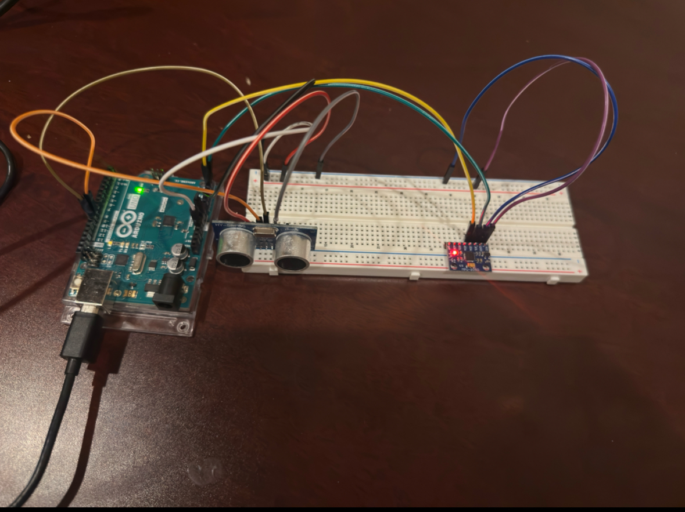
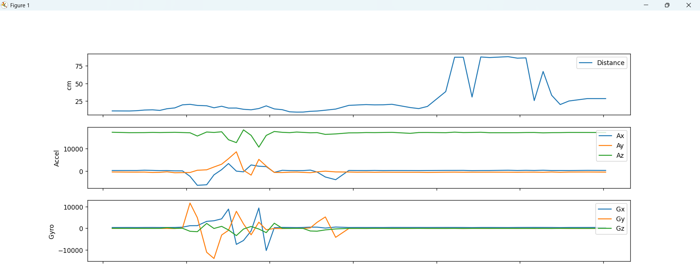
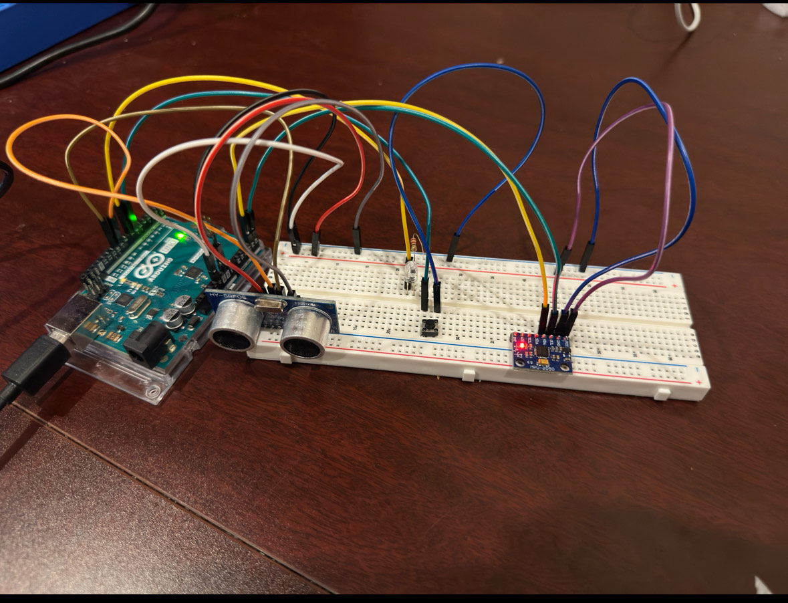
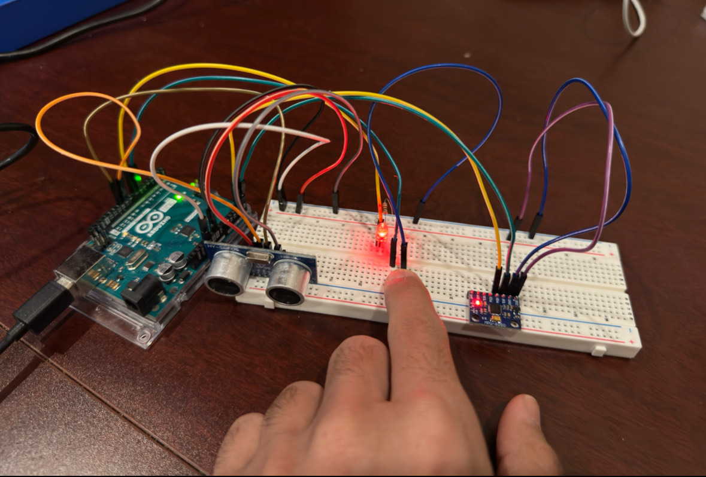
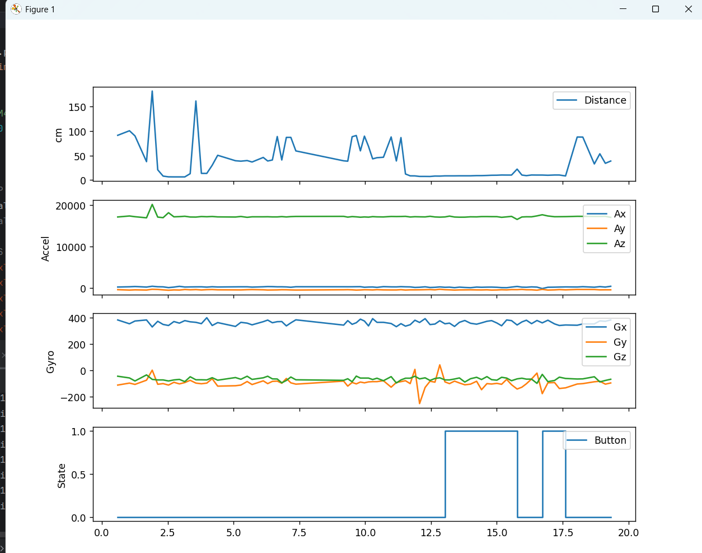

# Sensor Dashboard – Phase 1

## Overview
This project creates a real-time sensor dashboard using an Arduino Uno and Python.  
Phase 1 focuses on setting up and testing hardware sensors:
- HC-SR04 Ultrasonic Distance Sensor  
- MPU-6050 Accelerometer and Gyroscope  

Data is transmitted via serial communication to the computer and displayed for verification.

---

## Hardware Setup

**Components:**
- Arduino Uno  
- HC-SR04 Ultrasonic Sensor  
- MPU-6050 Accelerometer/Gyroscope  
- Breadboard  
- Jumper Wires  
- Resistors (optional for LEDs later)

---

### Circuit Photo  
 

---

### HC-SR04 Ultrasonic Sensor Pinout

| Sensor Pin | Arduino Pin |
|------------|-------------|
| VCC        | 5V          |
| GND        | GND         |
| Trig       | D9          |
| Echo       | D10         |

---

### MPU-6050 Sensor Pinout

| Sensor Pin | Arduino Pin |
|------------|-------------|
| VCC        | 5V        |
| GND        | GND         |
| SDA        | A4          |
| SCL        | A5          |

---

## Arduino Test Code

The following sketches were used to verify the hardware:

| Filename | Purpose |
|----------|---------|
| `phase1_distance.ino` | Test and output distance readings from the HC-SR04 sensor |
| `phase1_mpu6050.ino`  | Test and output accel/gyro data from the MPU-6050 sensor |

---

## Sample Serial Output
Distance (cm): 36.06
Accel (X Y Z): 244 -388 17160
Gyro (X Y Z): 368 -62 -80

---

## Phase 1 Completion

-  Built physical circuit with HC-SR04 and MPU6050  
-  Verified working serial output  
-  Uploaded and tested both Arduino sketches

---

#  Sensor Dashboard – Phase 2: Real-Time Python Plotting

## Overview
Phase 2 implements live data visualization using Python and Matplotlib.  
Sensor readings from the Arduino are streamed via serial and plotted in real time.

---

## Features

-  **Live distance plotting** from HC-SR04  
-  **Real-time accelerometer and gyroscope plotting** from MPU-6050  
-  Data filtering:
-  Range clamping (2–200 cm)
-  Change threshold (only send if delta > 5 cm)
-  Buffered plotting using Python `deque` to maintain live display

---

## Python Files

| Filename | Purpose |
|----------|---------|
| `Phase2_dashboard.py` | Plots live distance and motion data using Matplotlib |

---

## How It Works

- Arduino sends serial output like:
13.07,204,-460,17032,356,-97,-47

- Python script:
  - Parses the values
  - Appends to `deque` buffer
  - Plots live on three subplots (distance, accel, gyro)

---

## Sample Plot  

---

## Phase 2 Completion

- Developed Python script for real-time plotting  
- Integrated ultrasonic + IMU into one stream  
- Tested working graph and clean visualization  
- Python code organized and committed

---

# ✅ Sensor Dashboard – Phase 3: Button + LED + Full Integration

## Overview
Phase 3 completes the system by adding:
- A push-button input  
- An LED output that lights up when the button is pressed  
- A Python alert system for both proximity and button events  
- A fourth subplot to display live button states

---

## Features

- 🔘 **Button press detection** shown in graph and console  
- 💡 **LED output** toggled based on button input  
- ⚠️ **Alert system**:
  - Object within 20 cm → console warning
  - Button pressed → console log
- 📊 4 live graphs (distance, accel, gyro, button)

---

## Files

| Filename | Purpose |
|----------|---------|
| `phase3_firmware.ino` | Sends 8 values: distance, accel, gyro, button |
| `Sensor_dashboard.py` | Python script for live multi-panel dashboard |

---

## Circuit Photos  

**Full Circuit Setup:**  

**Button Pressed (LED On):**  

---

## Sample Serial Output
15.23,120,-40,16000,5,-10,2,1

_Last value = button state (1 = pressed)_

---

## Live plot Photos

## Phase 3 Completion

-  Button and LED integrated with Arduino + Python  
-  Final serial output includes 8 total values  
-  Live plotting with alert system complete  
-  Final dashboard demo tested and working  

---

## How to Run (Phase 3)

1. Upload `phase3_firmware.ino` to Arduino  
2. Run `sensor_dashboard.py` in terminal (Python 3)  
3. Watch the dashboard graph in real time  
4. Press the button and move hand near sensor to test alerts

